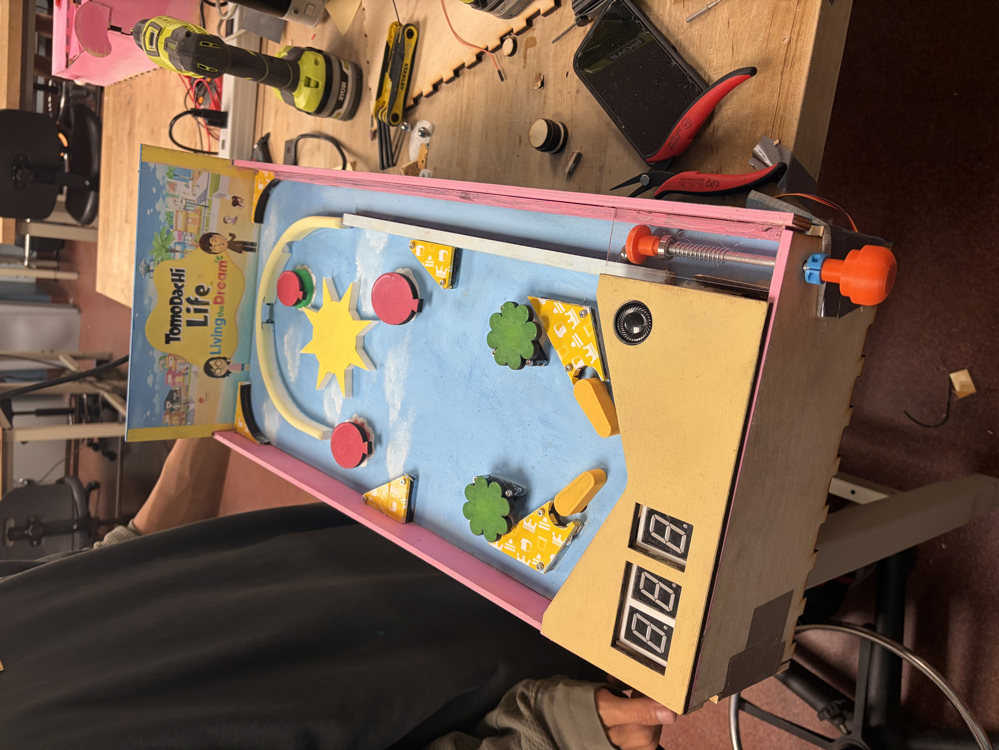
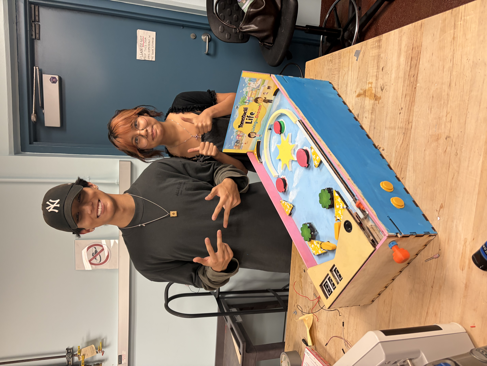

# Arduino Pinball Machine

A custom electromechanical pinball machine built using an Arduino Mega, MOSFET driver circuits, solenoids, IR sensors, piezo sensors, DC gear motors, servo-controlled ball launch gate, dual 7-segment displays, and DFPlayer Mini audio feedback.

I served as the **Hardware Lead** for this project, focusing on circuit integration, actuator control, sensor bring-up, power distribution, and debugging of the full electromechanical system.







---

## Project Overview

This project was developed as a final project for ECE 115. The goal was to design and build a functional pinball machine with interactive scoring, lives tracking, ball launch control, sound effects, and motorized gameplay elements.

The final system uses a finite state machine to control the game flow:

1. `RESET` — reset score, lives, and motor boost
2. `READY_IDLE` — wait for the start button
3. `LAUNCH_BALL` — run the servo gate sequence
4. `IN_PLAY` — run motors and process scoring and loss sensors
5. `BALL_LOST` — stop motors, remove one life, and play the losing sound
6. `NEXT_ROUND` — wait for the start button if lives remain
7. `GAME_OVER` — wait for the start button to reset the game

The player starts with 3 lives. When the ball enters the losing zone, one life is removed. If lives remain, the player must press the start button again to launch the next round. At zero lives, pressing start resets the game; another press launches the first ball. Scoring is handled within `IN_PLAY`, and the score is capped at 99.


---

## Key Features

- Arduino Mega-based game controller
- MOSFET driver circuits for solenoids and DC gear motors
- Solenoid flippers controlled using interrupt pins
- Servo-controlled launch gate
- Three DC gear motors active during gameplay
- IR break-beam sensor for scoring
- IR sensor for ball-loss detection
- Three piezo sensor inputs: A6 for scoring and motor speed changes; A8 and A9 for scoring
- Dual 7-segment displays for score and remaining lives
- DFPlayer Mini audio system for score, life-loss, and background music effects
- Finite state machine for reliable game-state control

---

## My Role: Hardware Lead

As Hardware Lead, I worked on the integration and debugging of the main electromechanical subsystems, including:

- Designed and tested MOSFET driver circuits for solenoids and DC gear motors
- Added flyback diode protection for inductive loads
- Integrated IR sensors for scoring and life-loss detection
- Integrated piezo sensors for collision/hit detection
- Wired and tested dual SN74HC595-based 7-segment displays
- Integrated DFPlayer Mini audio playback to replace direct speaker driving from Arduino pins
- Helped debug power, grounding, overheating, and signal-noise issues across the full system
- Assisted with organizing the Arduino code into modular tabs for motors, sensors, displays, solenoids, sound, and game logic

---

## Hardware Used

| Component | Purpose |
|---|---|
| Arduino Mega | Main game controller |
| N-channel MOSFETs | Switching solenoids and DC motors |
| Flyback diodes | Protection from inductive voltage spikes |
| Pull-type solenoids | Flipper / actuator control |
| DC gear motors | Motorized gameplay elements |
| Servo motor | Ball launch gate |
| IR break-beam sensors | Scoring and ball-loss detection |
| Three piezo sensors | A6: scoring and motor speed toggle; A8/A9: scoring |
| SN74HC595 shift registers | 7-segment display control |
| 7-segment displays | Score and lives display |
| DFPlayer Mini | Audio playback |
| 8 ohm speaker | Sound output |
| External power supplies | Motor, solenoid, and servo power |

---

## Current Firmware Behavior

### Servo Gate

Pressing the start button on **D4** runs the launch sequence using the servo on **D44**. The gate moves gradually from its **155° closed position** toward the **60° open position**, holds open for one second, then returns to 155° and detaches to reduce buzzing. Gameplay begins after the launch sequence finishes.

### Gear Motors

| Motor | Pin | Gameplay PWM |
|---|---|---|
| Gear motor 1 | D9 | 120 normal / 255 boosted |
| Gear motor 2 | D10 | 120 |
| Gear motor 3 | D11 | 120 |

Each accepted A6 piezo hit toggles motor 1 between normal and boosted speed. Motors stop between rounds and at game over.

### Scoring and Sensors

| Sensor | Pin | Gameplay action |
|---|---|---|
| Score IR sensor | D7 | Add 1 point and play the score sound |
| Loss IR sensor | D8 | End the round and remove one life |
| Main piezo sensor | A6 | Add 1 point, play the score sound, and toggle motor 1 speed |
| Additional piezo sensors | A8 / A9 | Add 1 point and play the score sound |

The game starts with **3 lives**, and the score is capped at **99**.

### Audio

The DFPlayer Mini provides scoring effects, life-loss audio, and background music.

| Audio file | Purpose |
|---|---|
| `media/0001.mp3` | Losing a life |
| `media/0002.mp3` | IR and piezo scoring |
| `media/0003.mp3` | Background music |

For launch timing, sensor thresholds, and current firmware limitations, see
[Firmware Notes](docs/firmware_notes.md).

---

## System Architecture

The Arduino Mega reads sensor inputs and controls outputs based on the current game state.

```text
Start Button ───────┐
Score IR Sensor ────┤
Loss IR Sensor ─────┤
Piezo Sensors ──────┤
Solenoid Buttons ───┤
                    ↓
              Arduino Mega
                    ↓
 ┌─────────────┬─────────────┬──────────────┬──────────────┐
 │ Solenoids   │ Gear Motors │ Servo Gate   │ DFPlayer Mini│
 │ Flippers    │ Gameplay    │ Ball Launch  │ Audio        │
 └─────────────┴─────────────┴──────────────┴──────────────┘
                    ↓
        Score Display + Lives Display
```
