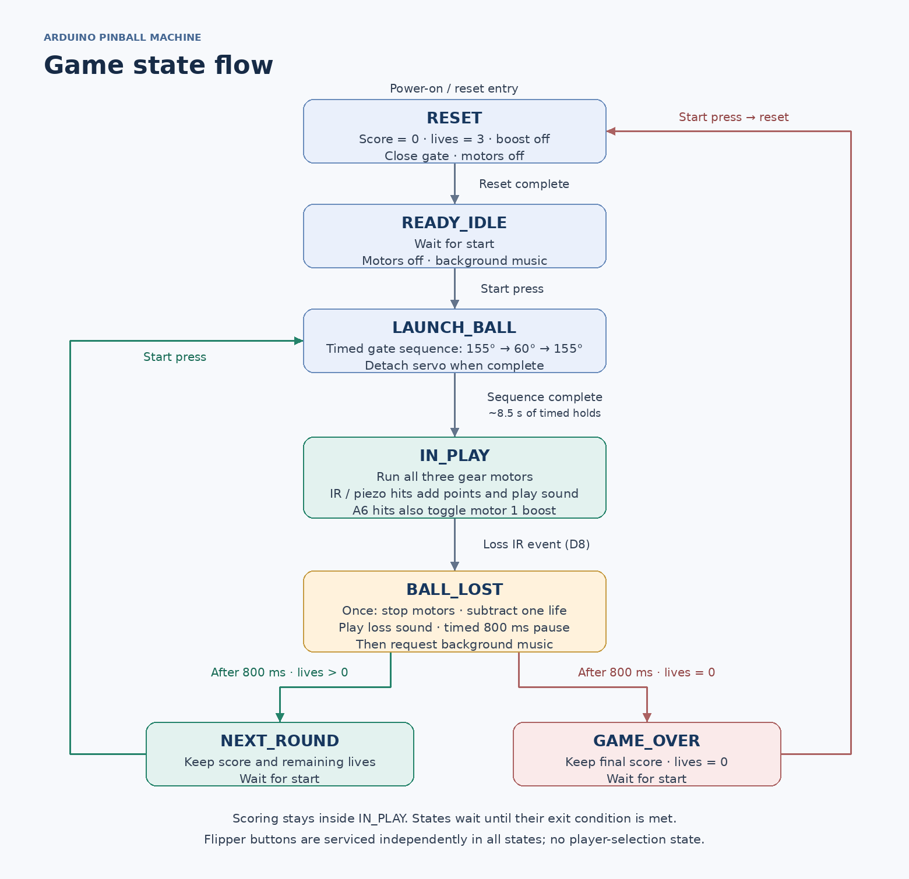

# Firmware Notes

These notes describe the revised `Pinball_Main.ino`, `Motors_Servo.ino`, and `Solenoids.ino` provided for the timing fix, together with the other five original tabs. Install all three revised tabs together. The earlier revision used blocking launch and life-loss delays.

**Validation status:** the revised timing logic passed a host-side simulation of both solenoid releases, the launch sequence, repeat launches, and life-loss transitions. Arduino Mega compilation and testing of this revision on the physical machine are pending. Earlier hardware operation does not validate the revised firmware.

## Game States

| State | Behavior | Exit condition |
|---|---|---|
| `RESET` | Set score to 0, lives to 3, boost off; stop motors and close gate; request background music | Reset completes → `READY_IDLE` |
| `READY_IDLE` | Motors off; wait for start | Start press → `LAUNCH_BALL` |
| `LAUNCH_BALL` | Advance the timed servo sequence | Sequence completes → `IN_PLAY` |
| `IN_PLAY` | Run motors and process IR/piezo scoring | Loss IR event → `BALL_LOST` |
| `BALL_LOST` | Once on entry: stop motors, decrement lives, play loss sound; wait using `millis()` | After 800 ms, request background music; lives > 0 → `NEXT_ROUND`, otherwise → `GAME_OVER` |
| `NEXT_ROUND` | Motors off; preserve score and remaining lives | Start press → `LAUNCH_BALL` |
| `GAME_OVER` | Motors off; retain final score and zero lives | Start press → `RESET` |

Scoring is an event within `IN_PLAY`, not a separate state. After game over, one start press resets the game and another launches the first ball. Start-button polling uses edge detection; release the button between presses.

## Servo Gate and Launch Timing

Signal: **D44**. Start button: **D4**. Closed: **155°**. Open: **60°**.

The launch commands are:

`155°, 150°, 145°, 140°, 135°, 130°, 125°, 120°, 115°, 110°, 105°, 100°, 95°, 92°, 60°, 155°`

Each position is held for at least **500 ms**, except the open position at **60°**, held for **1,000 ms**. The programmed holds total **8.5 seconds**; loop overhead can make the actual sequence slightly longer. The servo detaches after the final closed-position hold.

`launchBall()` returns `false` while the sequence is running and `true` when finished. The FSM enters `IN_PLAY` only on completion; motors begin running on the following loop pass. The loop continues refreshing displays and servicing solenoids throughout the timed sequence. Scoring and life-loss events are accepted only during `IN_PLAY`.

## Solenoid Control

| Flipper | Button input | MOSFET gate output |
|---|---|---|
| 1 | D2 | D12 |
| 2 | D3 | D13 |

Buttons use `INPUT_PULLUP` and connect to GND when pressed. `CHANGE` interrupts update volatile button-state flags. On release, the interrupt handler also writes the corresponding output LOW directly, so release does not wait for the main loop.

`updateSolenoids()` enables outputs for held buttons. Its brief interrupt-disabled section prevents an interrupted update from overwriting a release with an outdated HIGH value. It must be called from the main loop, not from another interrupt handler.

The revision preserves button-held operation in all game states. It does not limit flippers to `IN_PLAY`, debounce flipper buttons, or enforce a maximum energized time. Release switches off the MOSFET gate; coil current and mechanical release still depend on the driver and flyback circuit.

## Remaining Blocking Work

The launch sequence and 800 ms life-loss pause are nonblocking. The entire program is not fully nonblocking:

- `Game_Functions.ino` still waits 500 ms while closing the gate during reset.
- `Sensors.ino` still waits 30 ms after detecting a start press.
- `Display.ino` uses two 3 ms delays per score-display refresh.
- Setup includes a 1-second delay; serial printing and library calls can also take time.

The direct release interrupt handles button releases during ordinary delays while interrupts remain enabled. It is not a hardware watchdog or a guaranteed maximum coil-on-time mechanism.

## Gear Motors

| Motor | Pin | Normal PWM | Boosted PWM |
|---|---|---|---|
| 1 | D9 | 120 | 255 |
| 2 | D10 | 120 | Not used |
| 3 | D11 | 120 | Not used |

Each accepted A6 hit toggles motor 1 boost and adds one point. Boost carries over between rounds and clears on game reset. Motors stop between rounds and at game over.

## Sensor Detection

| Input | Pin | Trigger | Cooldown | Action in `IN_PLAY` |
|---|---|---|---|---|
| Score IR | D7 | LOW → HIGH | 300 ms | Add 1 point; score sound |
| Loss IR | D8 | HIGH → LOW | 1,000 ms | Enter `BALL_LOST` |
| Main piezo | A6 | ADC reading > 150 | 500 ms | Add 1 point; score sound; toggle motor 1 boost |
| Additional piezo | A8 | ADC reading > 190 | 500 ms | Add 1 point; score sound |
| Additional piezo | A9 | ADC reading > 190 | 500 ms | Add 1 point; score sound |

The comparisons require elapsed time to be greater than the configured cooldown. Each piezo has a separate timer. Piezo detection is threshold-based, so a sustained high reading can retrigger after the cooldown. The score is capped at **99**. A8 and A9 are active inputs in this code and should not be left floating. D7 is configured as `INPUT`; D8 uses `INPUT_PULLUP`. The trigger edges must match the actual sensor circuits.

## Audio and Known Timing Issue

The DFPlayer uses **Serial1, 9600 baud**, Mega D18/TX1 and D19/RX1. Volume is **28**. Initialization failure prints a message and the game continues without sound.

| Track index | Intended file | Purpose |
|---|---|---|
| 1 | `media/0001.mp3` | Losing a life |
| 2 | `media/0002.mp3` | IR and piezo scoring |
| 3 | `media/0003.mp3` | Background music |

Effects use `play(track)`; background music uses `loop(3)`. These are track-index commands; verify the physical SD card's playback order rather than assuming filenames alone establish it. The comment mentioning `0004.mp3` in `Sound.ino` is outdated: the configured background index is **3**.

The timing revision preserves the existing audio behavior:

1. `BALL_LOST` starts the loss sound and begins an 800 ms timed pause.
2. After that pause it requests background music, potentially interrupting the loss sound.
3. `Sound.ino` independently schedules a background request 3 seconds after the loss sound starts.
4. That pending request is not canceled when another round starts. It can restart background music during the revised launch sequence or subsequent gameplay.

This audio conflict remains unresolved. The firmware does not guarantee three seconds of uninterrupted loss audio. Its audio deadline comparison also does not handle `millis()` rollover; the revised launch and life-loss elapsed-time checks do.

See [Setup](setup.md) for loading the sketch and [Troubleshooting](troubleshooting.md) for build history and verification steps.
